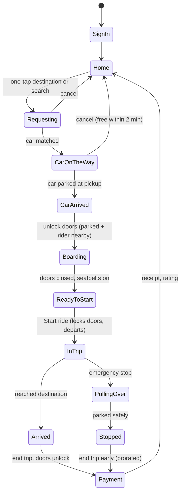

# Copilot Rides: iOS rider app plan

**Status:** Approved 2026-10-04; building P1-P3
**Date:** 2026-10-04

## 1. Goal

A rider-facing iPhone app for the fictional robotaxi service **Copilot Rides**, connected to the existing Fleet Ops Copilot portal: the same simulated fleet, the same rider support copilot (chat + voice), the same knowledge base. It completes the portfolio story: **ops console (operator side) + rider app (customer side) + AI copilot tying them together.**

## 2. Platform recommendation

Magic UI is a React web library (Tailwind + Motion). It doesn't run in native SwiftUI or React Native. Options:

| Option | Magic UI | Real iOS app | Recruiter can try it | Effort |
|---|---|---|---|---|
| **A. Mobile web app (PWA) + Capacitor iOS wrapper** (recommended) | Yes | Yes, via Xcode Simulator; device/TestFlight needs a $99/yr Apple developer account | Yes: a link that opens an iPhone frame on desktop, full screen on a phone, "Add to Home Screen" | Medium |
| B. React Native / Expo | No (rebuild visuals by hand) | Yes | Only via Expo Go or TestFlight | High |
| C. Native SwiftUI | No | Yes | Only via TestFlight | Highest |

**Recommendation: A.** Build it as a mobile-first route in the existing Next.js app (`/ride`), styled like an iOS app, shown inside Magic UI's iPhone frame on desktop. Then wrap it with Capacitor to produce a real iOS app that runs in the Simulator (Xcode is installed). One codebase; reuses the fleet sim, chat API, Vercel deploy and Magic UI setup.

## 3. Screens and flow

| # | Screen | Key content | Magic UI |
|---|---|---|---|
| 1 | **Sign in** | Demo rider sign-in (no real accounts or personal data); "Continue with Apple" styled but simulated | Text Animate, Particles background, Shimmer Button |
| 2 | **Home** | Map of nearest available cars; "Where to?" search; suggested destinations (Ferry Building, SFO, Oracle Park, Golden Gate Park...) each with **price and ETA**, one tap to request | Blur Fade cards, Number Ticker prices, Magic Card |
| 3 | **Finding your car** | Matching animation, fare locked, 2-minute free cancel countdown | Ripple / Orbiting Circles |
| 4 | **Car on the way** | Live map with the car moving along its route, ETA countdown, vehicle card (ID, model, roof-light color), Honk / Flash lights, chat, cancel | Animated Circular Progress (ETA), Border Beam |
| 5 | **Car has arrived** | "Your car is here", walking distance to car, vehicle details, **Unlock doors** enabled only when the car is parked and you're within ~30 m | Pulsating Button, Shine Border |
| 6 | **Get in** | Checklist: doors closed, seatbelts on; **Start ride** (closes and locks doors, departs) | Animated List, Rainbow Button |
| 7 | **In trip** | Route progress, arrival time, destination, **music** panel, chat/voice copilot, **Emergency** button | Number Ticker, Dock (bottom actions) |
| 8 | **Emergency sheet** | **Pull over now** (car stops at the next safe spot, not an instant brake), **Call 911** (real `tel:` link), **Call support** (connects copilot + agent handoff) | Pulsating Button |
| 9 | **Arrived** | "You've arrived", doors unlock after the car is parked, **End trip** | Confetti |
| 10 | **Payment & receipt** | Fare breakdown, charge (Apple Pay style), receipt, rate the ride, back to Home | Number Ticker, Blur Fade |

## 4. Safety rules (enforced in code, tested)

These are the product's core safety logic. They live in one trip state machine, not scattered in UI.

1. Doors can unlock only when the car is **stopped and in park**, never while moving.
2. Pickup unlock also requires the rider to be **near the car** (simulated proximity).
3. **Start ride** requires doors closed and every rider belted; starting locks the doors.
4. **Emergency stop** means "pull over at the next safe place", with the car's status visible throughout. It never cuts power mid-lane.
5. Call 911 is always one tap away during a trip, even if the app is offline.
6. Destination changes recalculate the fare; ending early charges only for distance traveled.

## 5. Integrations: real vs simulated

| Feature | Approach | What it needs from you |
|---|---|---|
| Map | Leaflet + Esri dark tiles (already used) | Nothing |
| Routes and ETA | Car follows a road route between points; ETA from distance and speed. Use the public OSRM demo router for real street routes, with straight-line fallback | Nothing |
| Fleet | Shared with the ops console's simulated fleet | Nothing |
| Rider chat + voice | Reuse `/api/rider-chat` and `/api/rider-tts` with **live trip context** (vehicle, ETA, destination, state) | Nothing |
| Sign in | Simulated demo account (no personal data collected) | Nothing |
| **Payments** | **Option 1:** simulated Apple Pay-style charge. **Option 2:** Stripe **test mode** (real API, test card 4242..., no real money) | Option 2: a free Stripe account |
| **Spotify** | **Option 1:** simulated player with sample playlists. **Option 2:** real Spotify sign-in (OAuth) to show *your* playlists and control playback on your active Spotify device | Option 2: a Spotify developer app; playback control requires Spotify Premium; developer-mode apps only work for allow-listed accounts |
| "Auto-connect via Bluetooth/Wi-Fi" | **Simulated**: a browser/app can't pair with a car. The UI shows "Connected to AV-1365 audio" when you board | Nothing |
| iOS build | Capacitor wraps the web app; runs in Xcode Simulator | Device/TestFlight: Apple Developer account ($99/yr) |

## 6. Build phases

| Phase | Ships | Checkpoint |
|---|---|---|
| **P1 Foundation** | `/ride` route, iPhone frame on desktop, sign-in, Home with map of nearby cars, suggested destinations with prices | You review look and feel |
| **P2 Trip flow** | Trip state machine + simulation: request → car en route (live ETA) → arrival → unlock → start → in trip → arrive → end → payment (simulated) → Home | Click-through of the whole ride |
| **P3 Copilot + emergency** | Chat/voice copilot inside the app with live trip context; emergency sheet (pull over, 911, support) | Emergency flow review |
| **P4 Music** | Simulated player; optional real Spotify sign-in | Decide Spotify option |
| **P5 Payments** | Simulated charge; optional Stripe test mode | Decide Stripe option |
| **P6 iOS + PWA** | Capacitor iOS project running in Simulator; installable PWA | Watch it run in the Simulator |
| **P7 Quality** | Unit tests for the safety rules; scripted full-ride click test; screenshots for the README | Test report |

## 7. Metrics to show (portfolio)

- Time from app open to car requested (target: 1 tap from Home)
- Safety rules: 100% of blocked actions covered by tests (unlock while moving, start with door open, ...)
- Copilot: trip-aware answers in the app use the same eval suite as the portal

## 8. Decision log

| # | Decision | Choice (2026-10-04) |
|---|---|---|
| 1 | Platform | Mobile web app in Next.js with Magic UI + Capacitor iOS wrapper |
| 2 | Spotify | Simulated player first; real Spotify sign-in possibly later |
| 3 | Payments | Stripe test mode (P5); simulated placeholder until then |
| 4 | First build | P1-P3 (core ride + copilot), then review |
